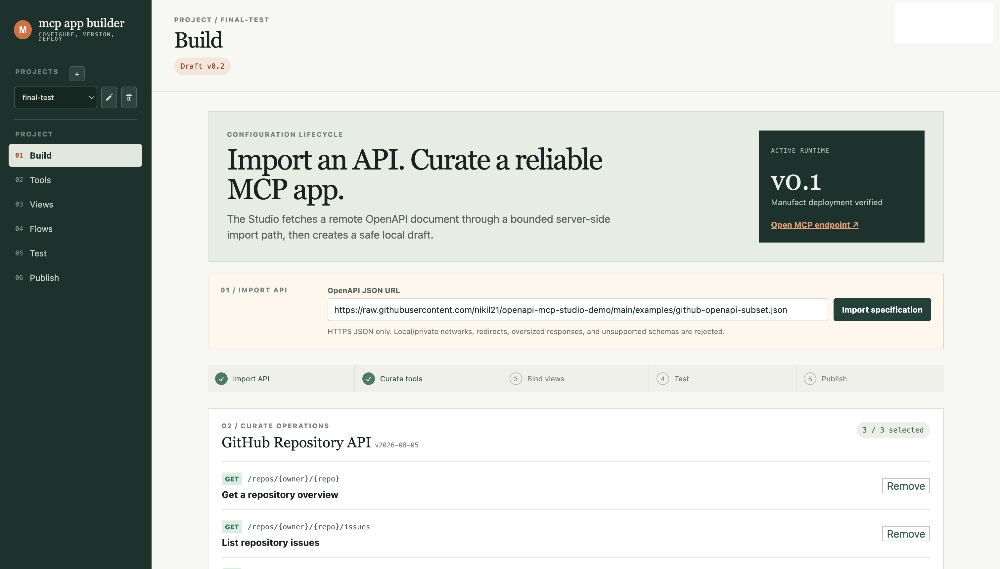
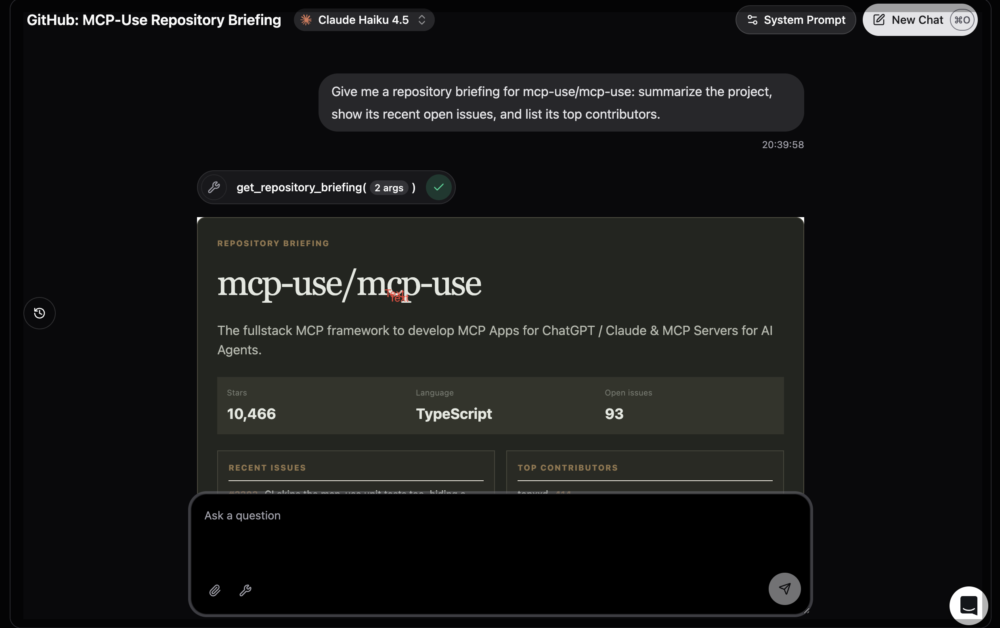
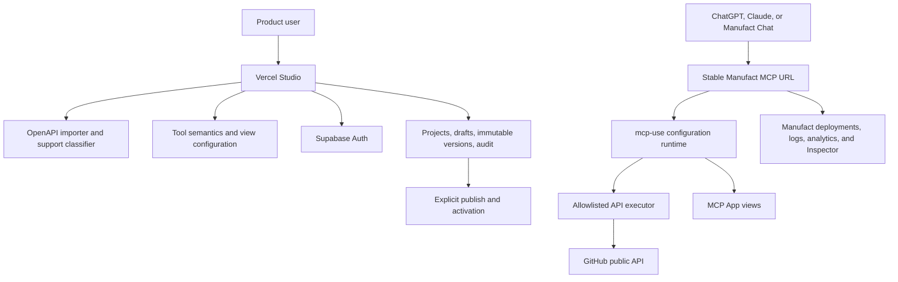

# Configurable MCP App Builder

A personal product exploration that turns a curated API into a versioned MCP App while Manufact provides the runtime and operating infrastructure.

> Personal clean-room product exploration built using public APIs, public documentation.

> This proof supports a curated GitHub API subset and constrained templates. It does not claim arbitrary OpenAPI compatibility, general OAuth mapping, generic write-action generation, billing, or app-store automation.

[Live Studio](https://openapi-mcp-studio-demo-82ptvk1y0-nikil22.vercel.app) | [Two-minute Demo](#demo-video-pending) | [Live MCP Chat](https://keen-forge-ocsbv.run.mcp-use.com/chat) | [Architecture](docs/architecture.md)

Built with: mcp-use v2 | Manufact Cloud | Vercel | Supabase

## Problem-Statement

Manufact makes MCP applications fast to scaffold, deploy, inspect, and operate. Product teams still need to decide which API operations should become tools, how tools are constrained and described, how results render, and how changes are published safely over time.

## What This Demonstrates

The builder imports a curated API description, curates operations into safe MCP tools, binds reusable interactive views, publishes immutable configurations, and operates them through a stable Manufact-hosted MCP URL.

It explores the recurring configuration and release lifecycle after an initial codebase exists, rather than one-time prompt-to-code generation.





## Three-Minute Flow

1. Import the GitHub OpenAPI fixture and review supported operations.
2. Configure overview, issues, and contributors tools with bounded semantics and views.
3. Compose the Repository Briefing flow, save a draft, publish it, and link a stable project runtime.
4. Redeploy that same Manufact runtime to activate the published version without changing the MCP URL.

## Architecture



## Live Proof

- Shared MCP demo: `https://keen-forge-ocsbv.run.mcp-use.com/mcp`
- Shared chat: `https://keen-forge-ocsbv.run.mcp-use.com/chat`
- Hosted Foundry: deployed on Vercel; the current deployment URL is managed in Vercel.

## Primary Demo

Import the public GitHub fixture:

```text
https://raw.githubusercontent.com/nikil21/openapi-mcp-studio-demo/main/examples/github-openapi-subset.json
```

The workflow is:

```text
Import -> curate up to three tools -> bind views -> compose a constrained flow
-> save immutable draft -> publish -> link stable project runtime -> redeploy runtime
```

The reference runtime exposes repository overview, issues, contributors, and a combined Repository Briefing flow. Publishing changes the desired version; a deliberate redeploy of the same project runtime activates it.

## Hosted Foundry

Foundry provides:

- Supabase email/password authentication and user-owned projects.
- Immutable draft, published, and superseded configuration versions.
- Project create, rename, switch, and protected delete controls.
- Safe public OpenAPI import with HTTPS, DNS, redirect, timeout, and response-size controls.
- A constrained linear Repository Briefing flow with execution trace.
- A stable Manufact MCP server connection per project.

Each project has one stable MCP URL. Draft and published versions do not create new servers. The project owner manually redeploys that linked server to activate a published version.

## Optional Technical Reference

`examples/lead-api-openapi.json` and the related runtime code demonstrate a fixed demo-only confirmation-gated write safety pattern. It is not part of the primary GitHub Repository Briefing narrative, not a general POST generator, and not a CRM integration. Do not submit real customer data.

## Local Development

Node `>=22.22.2` is required. This workspace uses Node 24:

```bash
export PATH="/opt/homebrew/bin:$PATH"
npm install
npm run test
npm run typecheck
npm run build
```

Run the MCP runtime:

```bash
npm run dev
```

Run Foundry locally in separate terminals:

```bash
npm --prefix studio run dev:api
npm --prefix studio run dev
```

For the local lead sandbox:

```bash
npm run sandbox:leads
NODE_ENV=development LEAD_SANDBOX_URL=http://127.0.0.1:8788 npm run dev
```

## Security Boundary

- Clean-room code, public APIs, and no committed secrets.
- Explicit HTTPS host allowlists, redirect blocking, timeouts, and bounded responses.
- Server-owned authorization headers and server-only Supabase service credentials.
- Supabase Auth, owner-scoped Studio API routes, and RLS policies.
- No arbitrary code, workflow DAGs, OAuth, generic writes, or production CRM connections.

## Documentation

- [`docs/product-brief.md`](docs/product-brief.md): product boundary and supported path.
- [`docs/architecture.md`](docs/architecture.md): hosted architecture and release boundary.
- [`docs/demo-script.md`](docs/demo-script.md): two-minute demo walkthrough.
- [`docs/phase-2.md`](docs/phase-2.md) and [`docs/phase-3.md`](docs/phase-3.md): original plans and deferred scope.
- [`docs/threat-model.md`](docs/threat-model.md): current controls and known limitations.
- [`BUILD_REPORT.md`](BUILD_REPORT.md): build outcome and verification summary.

## Demo Video Pending

The two-minute product demo and screenshot set are the next application-packaging artifacts. The current live Studio and MCP links above are available for verification.
